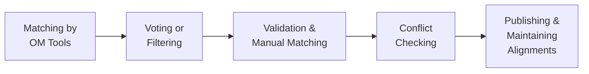

# Support for Maintenance

## Methodological Support

### Ontology Development Methodology

The development of CEON and the use case ontologies has followed a variant of the **eXtreme Design (XD)** methodology combined with **Modular Ontology Modeling (MOMo)**. This same methodology should be followed in future maintenance activities. For full details, see the [Methodology](../methodology/methodology.md) page.

### Application to maintenance scenarios

| Scenario | Recommended approach |
|---|---|
| [Scenario 1](scenarios.md#scenario-1-reuse-and-extension) | Follow XD/MOMo methodology to extend existing modules or create new specializations |
| [Scenario 2](scenarios.md#scenario-2-new-or-evolving-requirements) | Follow XD/MOMo methodology to update content or structure based on new requirements |
| [Scenario 3](scenarios.md#scenario-3-bug-fixes) | Use GitHub issue tracking and pull requests |

### Ontology Alignment at OAEI

Ontology alignment is an essential activity in maintenance, particularly for [Scenario 1](scenarios.md#scenario-1-reuse-and-extension) involving reuse and extension. The Onto-DESIDE project established a pipeline for ontology alignment covering three key tasks:

- **Task a** — aligning CE-specific ontologies with each other
- **Task b** — aligning CEON with industry domain-specific ontologies
- **Task c** — aligning CEON with top-level ontologies

The pipeline consists of five steps:

Onto-DESIDE also created a dedicated **CE track at OAEI** in 2024, enabling systematic assessment of how well CEON aligns with other CE-related ontologies. More information: [OAEI 2024 CE track](https://oaei.ontologymatching.org/2024/ce/index.html)

---

### CE-related Ontology Catalog

To support ongoing alignment and interoperability efforts, the Onto-DESIDE project compiled a catalog of CE-related ontologies across six focus domains:

| Domain | Topics |
|---|---|
| Circular Economy | Business models, resource recovery, waste, recycling, circularity assessment |
| Sustainability | Sustainability goals, performance, environment, energy |
| Materials | Raw materials, material composition |
| Logistics | Distribution, production, supply chain |
| Manufacturing | Manufacturing processes |
| Products | Product lifecycle |

The catalog will continue to be maintained by regularly monitoring [prefix.cc](http://prefix.cc/) and [LOV](https://lov.linkeddata.es/dataset/lov/) — two ontology registries where CEON is already registered.

Full catalog: [liusemweb.github.io/Circular-Economy-Ontology-Catalogue](https://liusemweb.github.io/Circular-Economy-Ontology-Catalogue/)