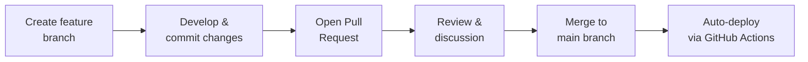

# Technical Support

## Ontology Development via GitHub

The [CEON GitHub repository](https://github.com/LiUSemWeb/CEON) is the central platform for ontology development, versioning, and publication. The collaborative workflow established during Onto-DESIDE will continue to support future maintenance.

### Workflow

### Key practices

- **Branching** — development happens on feature branches, keeping the `main` branch stable
- **Commit messages** — clear, descriptive messages document the history of progress
- **Pull Requests** — formal proposals to merge changes, including summaries, diffs, and links to related issues
- **Issues** — used to track bugs, tasks, and feature requests; can be assigned, labelled, and linked to PRs
- **Releases** — new versions are published using GitHub's release tools, providing clear milestones and version history

### Developer guidelines

Full developer guidelines are documented in the [CEON README](https://github.com/LiUSemWeb/CEON/blob/develop/README.md).

---

## CE-related Ontology Catalog

To support ongoing alignment and interoperability efforts, the Onto-DESIDE project compiled and documented a catalog of CE-related ontologies identified through a comprehensive literature study.

### Focus domains

| Domain | Topics |
|---|---|
| Circular Economy | Business models, resource recovery, waste, recycling, circularity assessment |
| Sustainability | Sustainability goals, performance, environment, energy |
| Materials | Raw materials, material composition |
| Logistics | Distribution, production, supply chain |
| Manufacturing | Manufacturing processes |
| Products | Product lifecycle |

### Ongoing monitoring

The catalog will continue to be maintained beyond the Onto-DESIDE project by regularly monitoring:

- [prefix.cc](http://prefix.cc/) — ontology prefix registry where CEON is registered
- [LOV (Linked Open Vocabularies)](https://lov.linkeddata.es/dataset/lov/) — ontology registry where CEON is registered

The full catalog is available at: [liusemweb.github.io/Circular-Economy-Ontology-Catalogue](https://liusemweb.github.io/Circular-Economy-Ontology-Catalogue/)
