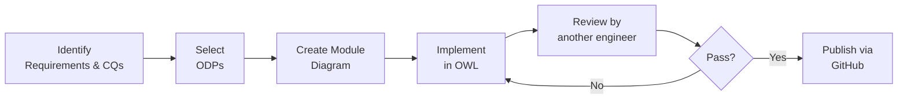
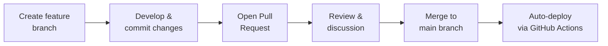

# Ontology Development and Publishing

The XD methodology was slightly adapted for the Onto-DESIDE project context. Specifically, the XD principle of **pair design** was modified — rather than requiring ontology engineers to work continuously in pairs, a **review-based approach** was adopted instead:

1. An ontology module is created by one ontology engineer
2. It is then reviewed by another ontology engineer

This approach is in line with **code review practices** in software engineering, ensuring quality without requiring continuous synchronization.

### Development pipeline

### Ontology Deployment via GitHub

The [CEON GitHub repository](https://github.com/LiUSemWeb/CEON) is the central platform for ontology development, versioning, and publication. The collaborative workflow established during Onto-DESIDE will continue to support future maintenance.

Key practices:

- **Branching** — development happens on feature branches, keeping `main` stable
- **Commit messages** — clear, descriptive messages document the history of progress
- **Pull Requests** — formal proposals to merge changes, including summaries, diffs, and links to related issues
- **Issues** — used to track bugs, tasks, and feature requests
- **Releases** — new versions published using GitHub's release tools

Full developer guidelines are in the [CEON README](https://github.com/LiUSemWeb/CEON/blob/develop/README.md).

### Versioning and publishing

The development of the ontology network entailed multiple interdependent ontologies, several of which went through multiple development iterations. To manage this:

- A **GitHub repository** is used for versioning and creating new releases
- The **w3id service** provides permanent identifiers under a common namespace at `http://w3id.org/CEON/`

